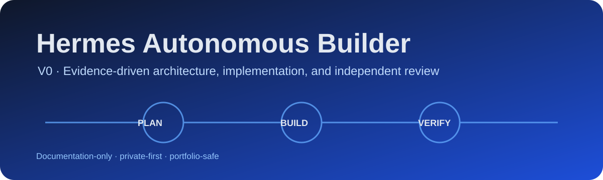
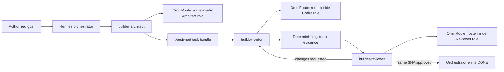

  

# Hermes Autonomous Builder V0

A portfolio-ready, evidence-driven specification for a future autonomous software builder. The design coordinates three independent roles—Architect, Coder, and Reviewer—while OmniRoute selects an eligible provider route within each role. The repository documents the V0 contract; it does not contain or run the builder.

## Why this exists

Autonomous coding systems often confuse a plausible answer with a verified result. This design makes success an explicit state transition backed by immutable evidence: tested Git SHA, command exit codes, scoped diffs, acceptance-criterion mappings, and approval by a model that did not author the change.

## V0 role policy

| Role | Primary | In-role fallback | Boundary |
|---|---|---|---|
| `builder-architect` | Claude Sonnet 4.6 via Antigravity | GLM-5.2 via NVIDIA NIM | Produces specification and approved task bundle |
| `builder-coder` | GLM-5.2 via NVIDIA NIM | None in V0 | Implements and tests; never self-approves |
| `builder-reviewer` | Grok 4.5 via Grok Build | Claude Sonnet 4.6 via Antigravity | Reviews the same tested SHA independently |

These are design decisions, not claims of production readiness. Every route still requires real Hermes tool-calling validation before activation.

## Architecture

Hermes changes roles and workflow states. OmniRoute only chooses a route within the active role; provider fallback never becomes an implicit role transition.

## Documentation map

- [Architecture V0](docs/ARCHITECTURE_V0.md) — components, state machine, boundaries, and acceptance criteria.
- [Model routing](docs/MODEL_ROUTING.md) — role combinations, independence, and route evidence.
- [Multi-account operations](docs/MULTI_ACCOUNT_OPERATIONS.md) — safe balancing and rate-limit policy.
- [Orchestration contracts](docs/ORCHESTRATION_CONTRACTS.md) — handoffs, rejection rules, and schemas.
- [Evidence and gates](docs/EVIDENCE_AND_GATES.md) — proof required before review and `DONE`.
- [Security and isolation](docs/SECURITY_AND_ISOLATION.md) — workspace, credentials, and publication boundaries.
- [Operations](docs/OPERATIONS.md) — planned runbook and failure recovery.
- [Model benchmarks](docs/MODEL_BENCHMARKS.md) — sanitized evidence history and open validations.
- [Decisions](docs/DECISIONS.md) — architecture decision log.
- [Roadmap](docs/ROADMAP.md) — staged path from documentation to controlled validation.

Machine-readable contracts live in [`schemas/`](schemas/). A concise Portuguese digest is available in [README.pt-BR.md](README.pt-BR.md).

## Repository scope

Included:

- sanitized V0 architecture and model-routing decisions;
- state, handoff, evidence, security, and recovery contracts;
- publication governance and repository safety tests;
- implementation phases, risks, and acceptance plan.

Excluded:

- executable agent or orchestration code;
- infrastructure configuration, services, cron, Telegram, VPS, or live OmniRoute changes;
- credentials, account identities, raw provider inventories, private endpoints, or internal audit dumps;
- claims that unexecuted operational controls are already enabled.

## Current status

The documentation baseline is ready for private review. Implementation remains deliberately blocked until the tool-calling, fallback, quota, recovery, security, and reviewer-independence acceptance plan is approved and executed in an isolated environment.

## Contributing and security

Read [CONTRIBUTING.md](CONTRIBUTING.md) before proposing changes. Report sensitive findings through the private process in [SECURITY.md](SECURITY.md); never open an issue containing a secret or account detail.

## License

Released under the [MIT License](LICENSE). Provider and model names belong to their respective owners.
