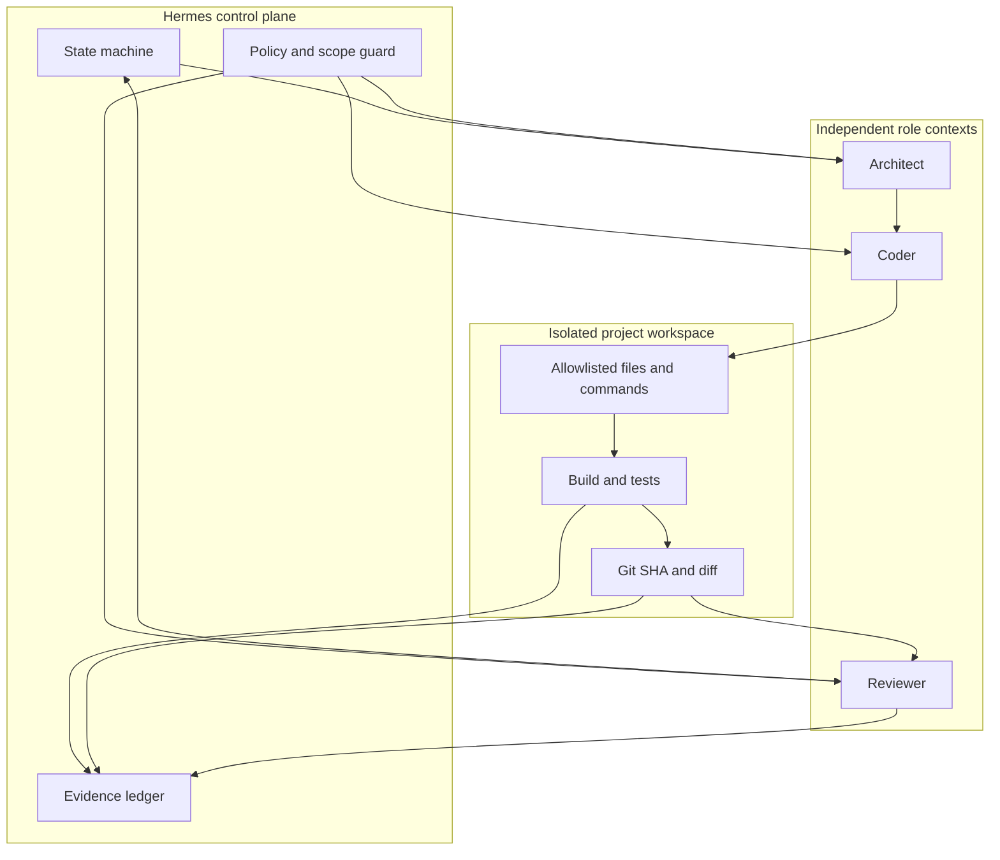

# Architecture V0

## Objective

Hermes Autonomous Builder V0 is a sequential, evidence-driven design for turning an authorized software goal into a reviewed Git commit. It separates planning, implementation, and approval so that a capable model cannot silently redefine the task, claim unexecuted tests, or approve its own work.

## System boundary

The future builder is a second logical Hermes profile with its own workspace, memory, service identity, and restricted GitHub scope. It may reuse an existing OmniRoute installation later, but it must not modify the Hermes profile or route combination used by existing automations.



## State machine

```text
CREATED -> PLANNING -> PLAN_READY -> IMPLEMENTING -> TESTING
        -> REVIEWING -> APPROVED -> DONE
                         |-> CHANGES_REQUESTED -> IMPLEMENTING
Any active state may become BLOCKED or FAILED.
```

Rules:

- Only Hermes may advance workflow states or emit `DONE`.
- Any code change after review invalidates approval and returns the run to `REVIEWING`.
- `BLOCKED` is required when context, authorization, route, quota, tool, or required test is unavailable.
- V0 permits at most two automatic correction attempts for one task.
- V0 is sequential; parallel or asynchronous task execution is deferred.

## Core components

| Component | Responsibility | Must not do |
|---|---|---|
| Hermes orchestrator | State transitions, context isolation, retry limits, final decision | Select itself as a role or accept textual success as proof |
| Architect role | Goal, non-goals, risks, task graph, acceptance criteria | Modify source code or approve implementation |
| Coder role | Scoped edits, commands, tests, evidence package | Expand scope or approve its own work |
| Reviewer role | Re-run gates, map criteria to evidence, issue verdict | Review a different SHA or inherit hidden author context |
| OmniRoute | Select an eligible provider route inside one role | Change roles or mark a project complete |
| Evidence ledger | Append-only attempts, commands, hashes, findings | Rewrite prior failures |

## V0 acceptance criteria

V0 may be considered implementation-ready only when all criteria have evidence:

1. The three role contracts validate against the published schemas.
2. Workspace writes outside the authorized project are rejected and tested.
3. Each command is recorded with exit code and duration; required failures block progress.
4. The Coder cannot generate a reviewer approval for its own run.
5. The Reviewer validates the exact tested Git SHA and rejects later mutations.
6. Each acceptance criterion maps to a file, command, test, or artifact hash.
7. Missing context produces `CONTEXT_INSUFFICIENT` and `BLOCKED`.
8. Primary-route failure exercises an in-role fallback without changing the role.
9. Quota and rate-limit scenarios produce cooldown/rotation evidence, not retry storms.
10. Crash recovery resumes from durable state without duplicating side effects.
11. Two failed repair attempts stop automatic changes and escalate.
12. No critical/high finding, skipped mandatory test, or out-of-scope file remains at `DONE`.

## Explicit non-goals

- Production deployment, service creation, cron, Telegram, or VPS changes.
- Automatic merge or public publication.
- Multiple skill systems, external long-term memory, or parallel execution.
- Unverified provider or multi-account configuration claims.
